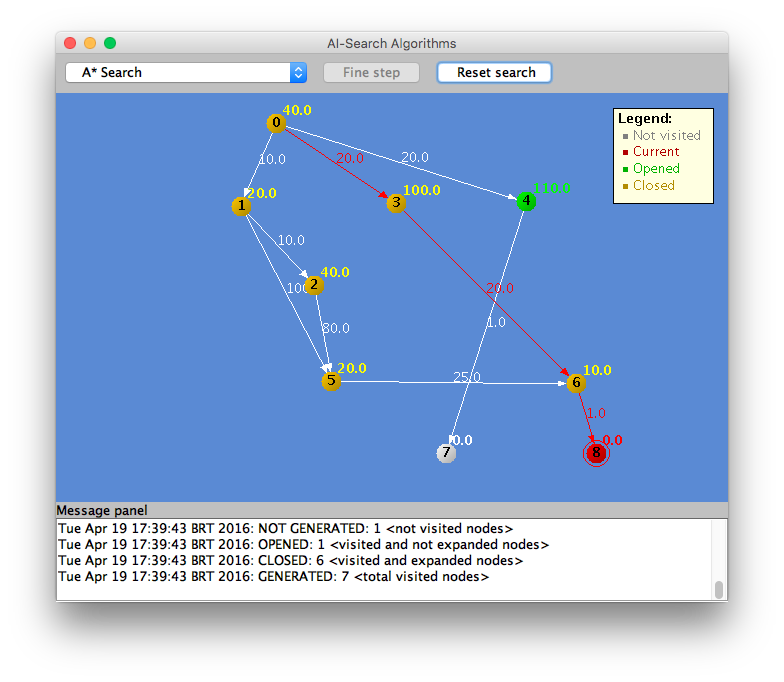

# Artificial Intelligence Algorithms with Java

Animation software for algorithms Artificial Intelligence

### Prerequires

1. Git 2.6+
2. Maven 3+
3. Java 8+


### How to Play

Clone

```
git clone https://github.com/humbertodias/java-ai-search-algorithms.git
```

Inside the folder

```
cd java-ai-search-algorithms
```

Run

```
mvn compile exec:java -Dexec.mainClass="com.aisearch.AISearch" -Dexec.args="src/main/resources/graph_01.txt"
```


### Output



### References

[A* search algorithm](https://en.wikipedia.org/wiki/A*_search_algorithm)