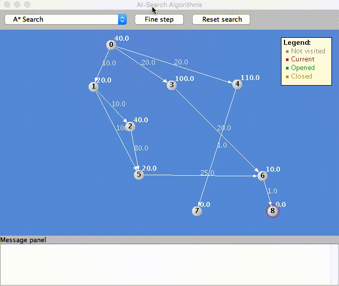

# Artificial Intelligence Algorithms with Java

Animation software for algorithms Artificial Intelligence

**Supported Search Algorithms:**

- Breadth-First Search 
- Depth-First Search 
- Simple Hill Climbing 
- Steepest Ascent Hill Climbing 
- Best First Search 
- A* Search

## Prerequires

1. Git 2.6+
2. Maven 3+
3. Java 8+


## How to Play

Clone

```
git clone https://github.com/humbertodias/java-ai-search-algorithms.git
```

Inside the folder

```
cd java-ai-search-algorithms
```

Run

```
mvn compile exec:java -Dexec.mainClass="com.aisearch.AISearch" -Dexec.args="src/main/resources/graph_01.txt"
```


## Output



## File format

Example of
[src/main/resources/graph_01.txt](src/main/resources/graph_01.txt)

```
9
0
220,30
40
NO
...
```

| Description | Value |
| ------------- | ----------- |
| Total Nodes | 3 |
| Node Name | 0 |
| Position X,Position Y | 220,30 |
| Value Node | 40 |
| Is Target Node | NO |
| ... | 


## References

- [Breadth-First Search](https://en.wikipedia.org/wiki/Breadth-first_search)
- [Depth-First Search](https://en.wikipedia.org/wiki/Depth-first_search) 
- [Simple Hill Climbing](https://en.wikipedia.org/wiki/Hill_climbing) 
- [Steepest Ascent Hill Climbing](https://en.wikipedia.org/wiki/Hill_climbing) 
- [Best First Search](https://en.wikipedia.org/wiki/Best-first_search) 
- [A* Search](https://en.wikipedia.org/wiki/A*_search_algorithm)

